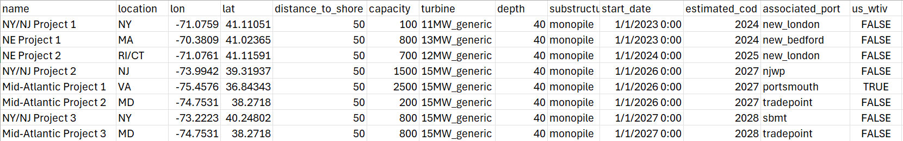

# How to use CORAL

This tutorial will walk through how to run CORAL and visualize results. 

## Input setup

There are two main input types for CORAL: pipelines and scenarios. The pipeline is the csv file with all project specific data.



Examples of pipelines can be found in library/pipelines. This is where the user should save their pipeline.

The scenario contains all vessel and port information as well as the associated pipeline for a CORAL run. 

```{code-block} python
description:
- 'Example Altantic pipeline 1'
pipeline: example_atlantic_2024
allocations:
  ahts_vessel: !!python/tuple
  - example_ahts_vessel
  - 2
  feeder: 
  - !!python/tuple
    - example_heavy_feeder_1kit
    - 4
  - !!python/tuple
    - example_feeder
    - 4
  towing_vessel: !!python/tuple
  - example_towing_vessel
  - 10
  wtiv:
  - !!python/tuple
    - example_heavy_lift_vessel
    - 3
  - !!python/tuple
    - example_wtiv
    - 1
  port:
  - !!python/tuple
    - new_london
    - 1
  - !!python/tuple
    - new_bedford
    - 1
future_resources:
- - wtiv
  - example_wtiv
  - - 2030-01-01
remove_resources:
- - wtiv
  - example_heavy_lift_vessel
  - - 2035-01-01
```

## Running CORAL
The below command in the command line will run run_coral.py, a script that runs each scenario saved in the specified folder ("foldername") and saving both the resource pool history and the ORBIT logs for each scenario in individual csv files within a folder of the same name in postprocessing/results.

```{code-block} python
python run_coral.py foldername

```

The line below would be used to run the example scenarios provided.

```{code-block} python
python run_coral.py atlantic_example
```
The output folder would be names atlantic_example and include the following files: atlantic_example_1_resource_history, atlantic_example_1_log, atlantic_example_2_resource_history, atlantic_example_2_log, atlantic_example_3_resource_history, atlantic_example_3_log.

These csv files are the basis of all the postprocessing done by coral_plotting.py, which can be run with the postprocessing script. 

## Running postprocessing script
The below command will run coral_postproc.py which creates a summary slide deck, including visualizations of individual runs and plots comparing the runs in the given folder. 
```{code-block} python 
python coral_postproc.py foldername
```
The figures included in the slide deck are created in the coral_plotting.py file and are saved to foldername_results.pptx in results/foldername.


